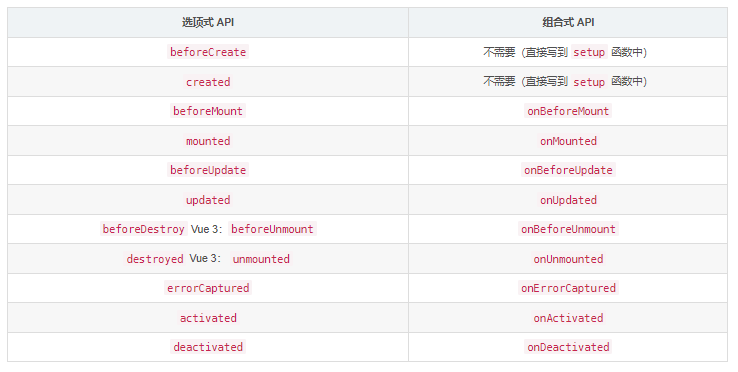

## Vue3

### Vue3 比 Vue2 有什么优势

- 更好的代码组织和逻辑抽离
  - 设计 `composition API `来代替 `option API`
  - 更便于可复用功能代码的封装提取, 代码可阅读性更高
- 体积更小

  - 将功能以多个函数提供出来, 我们会进行按需引入使用
  - 引入`tree-shaking`, 可以在打包压缩时, 将无用模块“摇掉”
- 性能更好/更快
  - 使用Proxy代替defineProperty来实现响应式效果

  - diff算法优化: 静态虚拟节点添加静态标记, 不进行diff比较

  - 静态提升: 静态虚拟节点提升到render的外面, 缓存起来, 不创建新的

- 更好的 TS 支持

  - 对TS的类型检查更友好
- 更好的脚手架工具vite

  - 启动运行快了很多


### Vue3 生命周期




### 组合API VS 选项API

- composition API 优点：

  - 更好的代码组织
  - 更好的逻辑复用
  - 更好的类型推导

- 如何选择：

  - 不建议共用，会引起混乱
  - 小型项目，业务逻辑简单，用 Options API
  - 中大型项目，逻辑复杂，用 Composition API

- 选项式 API（`Options API`）

  - 所有方法都写在 methods 中，如果 data 中数据越来越多，找数据会非常困难

    ```vue
    <template>
      <h1 @click="changeCount">{{ count }}</h1>
    </template>

    <script>
    export default {
      name: 'App',
      data() {
        return {
          count: 0,
        }
      },
      methods: {
        changeCount() {
          this.count++
        },
      },
    }
    </script>

    ```

- 组合式 API（`Composition API`）

  - 逻辑会清晰，可以让功能的代码集中抽取到一个函数中进行逻辑复用

    ```vue
    <template>
      <h1 @click="changeNum">{{ num }}</h1>
    </template>

    <script>
    import { ref } from 'vue'
    function useNum() {
      const num = ref(0)
      function changeNum() {
        num.value++
      }
      return { changeNum, num }
    }
    export default {
      name: 'App',
      setup() {
        const { changeNum, num } = useNum()
        return {
          changeNum,
          num,
        }
      },
    }
    </script>

    ```


### 常用的组合API

- 启动函数
  - setup()
- 响应式: 核心
  - ref()
  - reactive()
  - computed()
  - watch()
- 响应式: 工具
  - toRefs()
- 生命周期勾子
  - onMounted()
  - onBeforeUnmount()


### 比较Vue2与Vue3的响应式(重要)

#### 1) vue2的响应式

- 核心: 
  - 对象: 通过defineProperty对对象的已有属性值的读取和修改进行劫持(监视/拦截)
  - 数组: 通过重写数组更新数组一系列更新元素的方法来实现元素修改的劫持

```js
Object.defineProperty(data, 'count', {
    get () {}, 
    set () {}
})
```

- 问题
  - 对象直接新添加的属性或删除已有属性, 界面不会自动更新
  - 直接通过下标替换/添加元素或更新length, 界面不会自动更新

#### 2) Vue3的响应式

- 核心: 
  - 通过Proxy(代理):  拦截对data任意属性的任意(13种)操作, 包括属性值的读写, 属性的添加, 属性的删除等...
  - 通过 Reflect(反射):  动态对代理对象的相应属性进行特定的操作
  - 文档:
    - https://developer.mozilla.org/zh-CN/docs/Web/JavaScript/Reference/Global_Objects/Proxy
    - https://developer.mozilla.org/zh-CN/docs/Web/JavaScript/Reference/Global_Objects/Reflect

```js
const p = new Proxy(data, {
	// 拦截读取属性值
    get (target, prop) {
    	return Reflect.get(target, prop)
    },
    // 拦截设置属性值或添加新属性
    set (target, prop, value) {
    	return Reflect.set(target, prop, value)
    },
    // 拦截删除属性
    deleteProperty (target, prop) {
    	return Reflect.deleteProperty(target, prop)
    }
})

p.name = 'tom'
```


```html
<!DOCTYPE html>
<html lang="en">
<head>
  <meta charset="UTF-8">
  <meta name="viewport" content="width=device-width, initial-scale=1.0">
  <title>Proxy 与 Reflect</title>
</head>
<body>
  <script>
    
    const user = {
      name: "John",
      age: 12
    };

    /* 
    proxyUser是代理对象, user是被代理对象
    后面所有的操作都是通过代理对象来操作被代理对象内部属性
    */
    const proxyUser = new Proxy(user, {

      get(target, prop) {
        console.log('劫持get()', prop)
        return Reflect.get(target, prop)
      },

      set(target, prop, val) {
        console.log('劫持set()', prop, val)
        return Reflect.set(target, prop, val); // (2)
      },

      deleteProperty (target, prop) {
        console.log('劫持delete属性', prop)
        return Reflect.deleteProperty(target, prop)
      }
    });
    // 读取属性值
    console.log(proxyUser===user)
    console.log(proxyUser.name, proxyUser.age)
    // 设置属性值
    proxyUser.name = 'bob'
    proxyUser.age = 13
    console.log(user)
    // 添加属性
    proxyUser.sex = '男'
    console.log(user)
    // 删除属性
    delete proxyUser.sex
    console.log(user)
  </script>
</body>
</html>
```


### pinia VS vuex

- Pinia 没有 `mutations`, 在`actions` 中可以直接同步更新state或异步更新state

- Pinia中可以包含多个store, 而且相互独立, 且不进行合并, 没有模块的嵌套结构
- 无需手动注册 store，创建出的store直接就可以使用
- 更好的 `TypeScript` 支持,  提示补全很到位


### vue-router V4的变化

- 创建路由器有变化
  - new Router 变成 createRouter
  - createWebHistory()与createWebHashHistory() 取代了 'history' 与 'hash'
- 动态添加路由
  - 以前可以一次添加多个: router.addRoutes(routes)
  - 现在只能一次添加一个: router.addRoute(route)
- 通配路由的path变了
  - 以前的path: *
  - 现在的path: /:pathMatch(.*)

### vue3 & TS  语法

- 声明接收props

  ```tsx
  // 定义接口, 约束prop
  interface Props {
    count: number;
    updateCount(val: number): void;
  }
  defineProps<Props>()
  ```

- 原生事件

  - 原生标签上绑定

  - 组件标签上绑定: 组件内部没有声明为自定义事件


- 自定义事件

  ```jsx
  // 声明事件
  const emit = defineEmits<{
    (e: 'xxx', val: string): void
    (e: 'click', val: object): void
    (e: 'increment', val: number): void
  }>()

  // ts 中分发事件
  emit('xxx', 'abc')

  // 模板中分发事件
  $emit('increment', 5)
  ```

- 全局事件总线

  - vue本身不再提供事件总线的API: 没有$on方法了
  - 需要使用 `mitt` 或 `pubsub-js`第三方工具包

- v-model的本质

  - 原生标签上: 动态value和原生的input监听

    ```vue
    <input type="text" :value="msg1" @input="msg1=($event.target as HTMLInputElement).value" />
    ```

  - 组件标签上: 动态modelValue(默认)和自定义的input监听

    ```vue
    <custom-input title="消息2" :modelValue="msg2" @update:modelValue="msg2=$event" />
    ```

- 向外暴露方法

  - 组件内部的方法默认在外部是不能调用的

  - 可以通过 defineExpose暴露

    ```
    defineExpose({
    	borrowMoney
    })
    ```

- 通过ref得到组件对象

  ```vue
  // 使用ref标识子组件
  <Son ref="sonRef"/>

  // 定义ref
  const sonRef = ref<InstanceType<typeof Son> | null>(null)

  // 通过ref得到子组件对象, 调用其暴露的方法
  sonRef.value?.borrowMoney(num)
  ```

